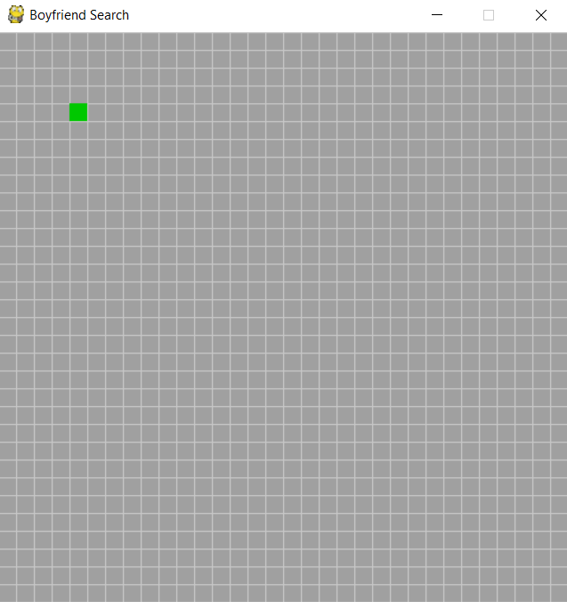
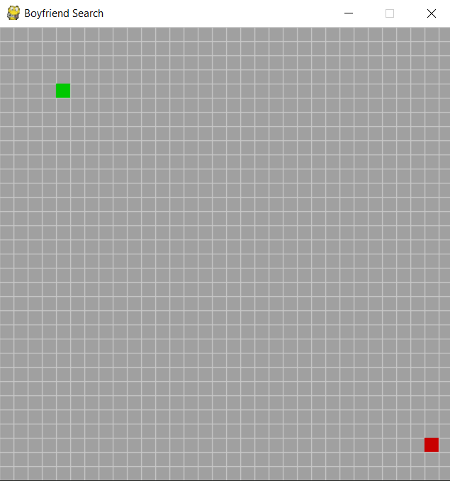
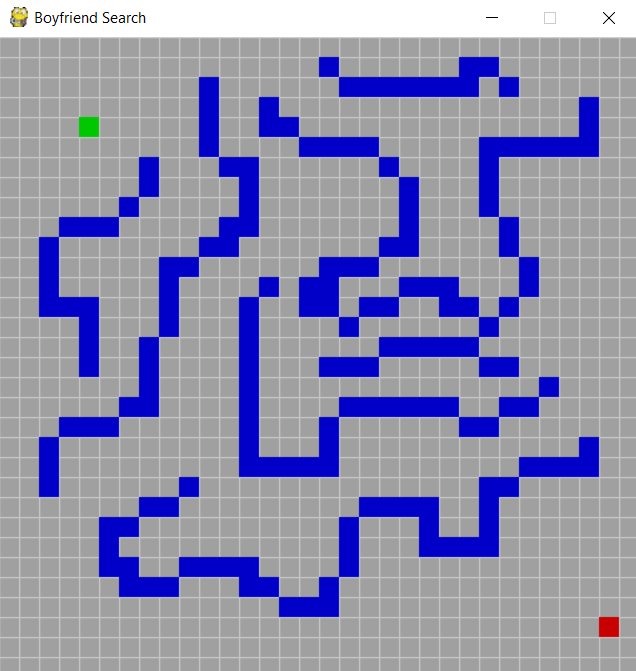
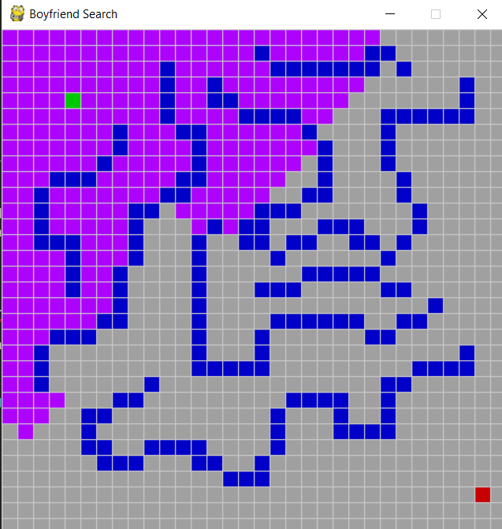
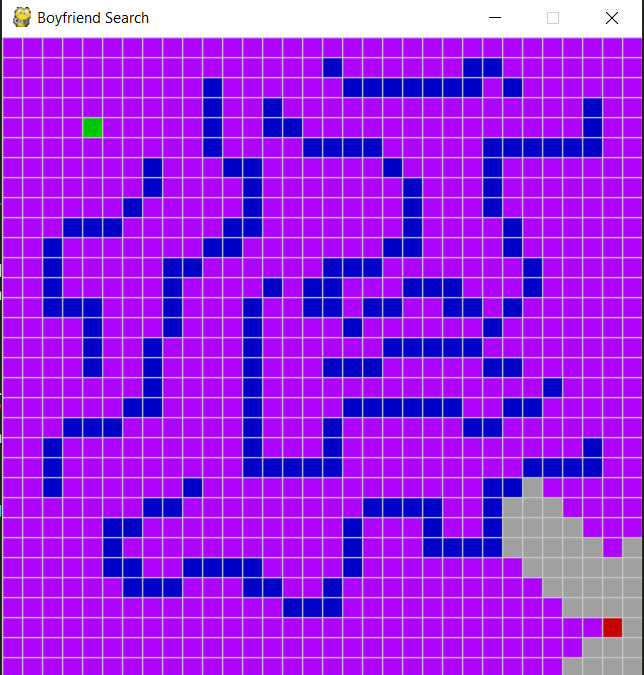

# Do-You-Need-A-BoyFriend
A BFS Algorithm visualization in python

In my batch, one of my classmates did this one in Java. I didn't know Java at that time so I implemented it in python. As previously I did some
games using pygame, I had some knowledge of pygame module. However, I didn't use it for a long time so I built it by keeping open the documentation
tab of pygame. I searched the youtube after I built it to get help on showing the shortest path highlighted in the grid and found an algorithm
called A*. In future I wish to accomodate the A* algorithm in this.

1. Empty grid -

2. Drawing Majnu. In the empty grid, the first mouse click is registeres as the position of the source vertex -

3. Drawing Laila. The second mouse click is registered as destination vertex -

4. Drawing hurdles between majnu and laila. After drawing source and destination, by dragging the mouse, blocked paths can be drawn on the grid -

5. Hit space bar and majnu's love will march towards laila. All the avaiable paths from source to destination is travarsed according to the BFS
algorithm until it reaches destination -

6. Spread love like this and Happy Coding :)

